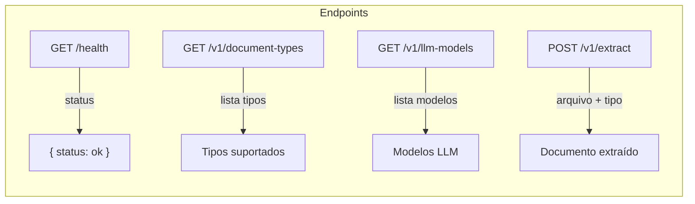
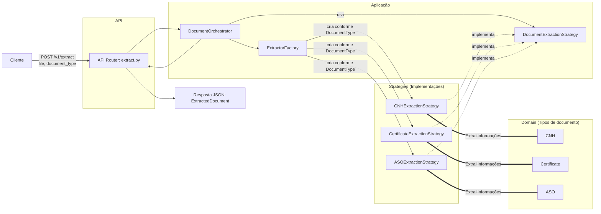
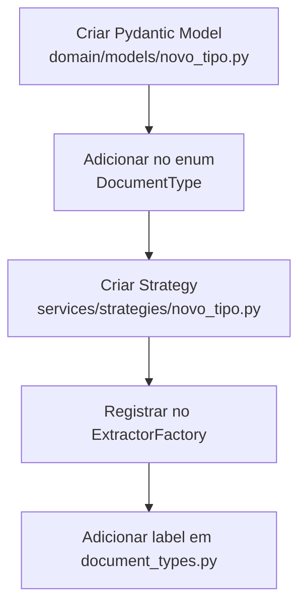

# Arquitetura do Backend (Doc Extractor)

Este documento descreve a arquitetura **somente do backend**, destacando o fluxo principal de extração via endpoint e a forma como o projeto é facilmente extensível por estratégias.

## Endpoints do Backend

## Visão Geral (Diagrama do Fluxo Principal)

## Extensibilidade (Como adicionar um novo tipo de documento)

A arquitetura segue Strategy + Factory, permitindo adicionar novos tipos sem mudar o fluxo principal. Passos resumidos:

**Resultado:** o endpoint `POST /v1/extract` continua o mesmo, mas passa a suportar o novo tipo automaticamente.