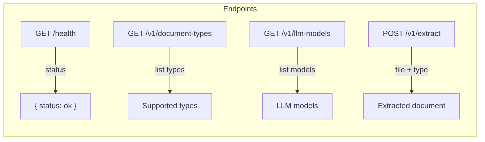
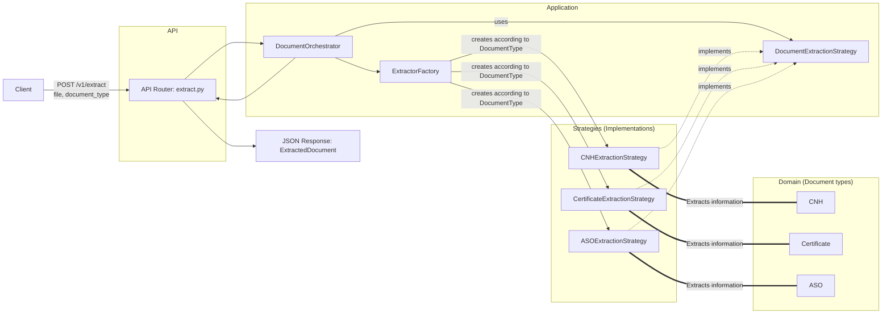
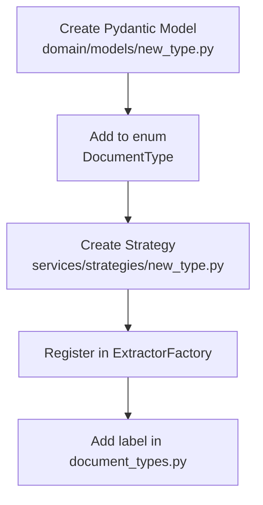

# Backend Architecture (Doc Extractor)

This document describes the **backend architecture only**, highlighting the main extraction flow via endpoint and how the project is easily extensible through strategies.

## Backend Endpoints

## Overview (Main Flow Diagram)

## Extensibility (How to add a new document type)

The architecture follows Strategy + Factory, allowing new types to be added without changing the main flow. Summary steps:

**Result:** the `POST /v1/extract` endpoint remains the same, but now supports the new type automatically.